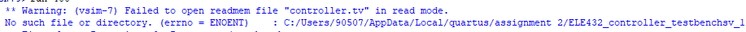
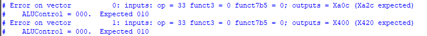
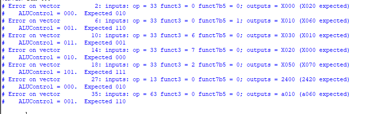
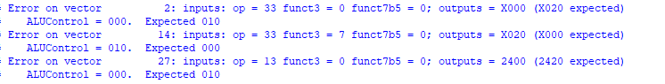
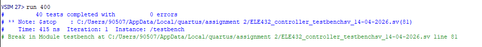

# ELE432 ASSIGNMENT 2
## Musa Mert Karakaya - 2210357056

## Overview

A hierarchical SystemVerilog implementation of the multicycle RISC-V processor 
controller. The controller is built from three submodules:

- `maindec` — 11-state Moore FSM controlling datapath signals
- `aludec` — combinational ALU operation decoder
- `instrdec` — combinational immediate source decoder

Supports: `lw`, `sw`, `add`, `sub`, `and`, `or`, `slt`, `addi`, `beq`, `jal`

## Module Hierarchy
PCWrite is computed at the top level:
```systemverilog
assign pcwrite = pcupdate | (branch & zero);
```

## Files

| File | Description |
|------|-------------|
| `controller.sv` | Full hierarchical SystemVerilog implementation |
| `controller_testbench.sv` | Provided testbench |
| `controller.tv` | Provided test vectors |

## Simulation

Tested with Questa Altera. To run:

```bash
vlog controller.sv
vsim -voptargs=+acc testbench
run 400
```

Expected result: `40 tests completed with 0 errors`

## Debugging Process

### Bug 1 — Test vector file not found

**Symptom:**


The testbench could not load `controller.tv` because the file was named 
`ELE432_controllertv_14-04-2026.tv`. The testbench hardcodes the filename 
as `controller.tv`.

**Fix:** Renamed the file to `controller.tv` in the working directory.

---

### Bug 2 — ALUControl encoding mismatch

**Symptom:**  
Every test vector failed with `ALUControl` wrong. Initial errors:



All ALUControl errors across all instruction types:



Remaining errors after partial analysis:



**Root Cause:**  
HDL Example 1 in the assignment PDF uses a different ALU encoding than 
the test vectors. The `aludec` module was coded from the PDF, producing 
wrong `ALUControl` values for every R-type and I-type instruction.

**Fix:** Updated `aludec` to match the encoding expected by `controller.tv`:

| Operation | PDF (wrong) | Correct |
|-----------|-------------|---------|
| add       | `000`       | `010`   |
| sub       | `001`       | `110`   |
| or        | `011`       | `001`   |
| and       | `010`       | `000`   |
| slt       | `101`       | `111`   |

---

### Final Result

After both fixes, all 40 tests pass with 0 errors:



## Waveform

Key signals monitored during simulation:
- `state` — FSM state transitions (S0 Fetch → S1 Decode → ...)
- `op` — instruction opcode driving state transitions
- `ALUControl` — verified correct encoding per instruction
- `pcwrite` — pulses high at every Fetch state
